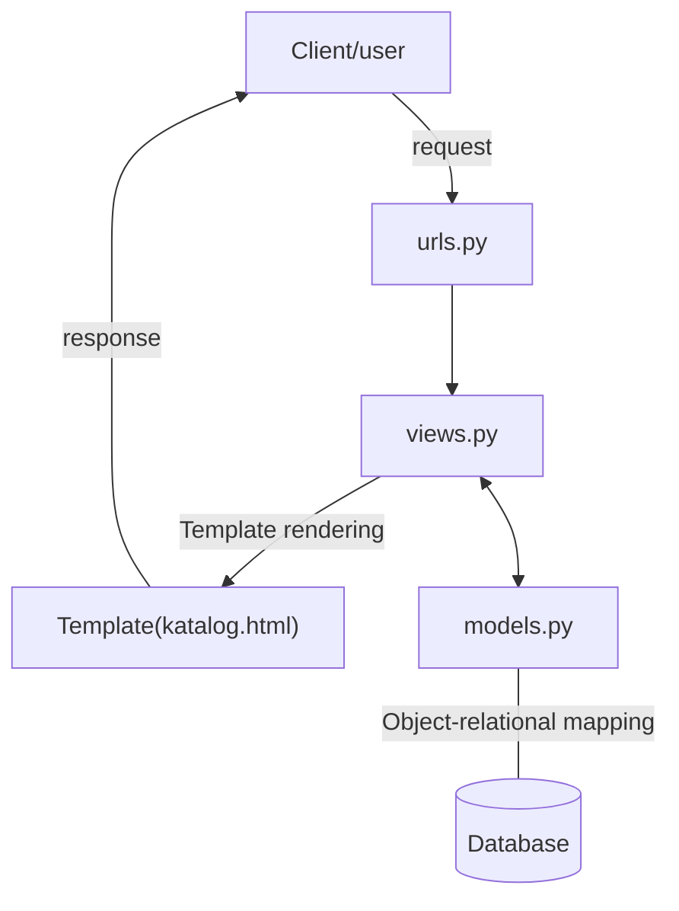

# Link Herokuapp
https://tugas2-pbp-fajar.herokuapp.com/katalog/

# Bagan Request Client

Penjelasan:
Request diminta oleh user ke server, request yang masuk ke dalam server Django akan diproses melalui urls (project/urls.py --> apps/urls.py) untuk diteruskan ke views.py. Di dalam views.py request akan diolah, apabila terdapat proses yang membutuhkan keterlibatan database, maka nantinya views akan memanggil query ke models untuk meminta data ke database lalu mengembalikannya ke views. Selain itu, views juga akan merender template yang diminta oleh user sebagai responsenya.

# Mengapa Kita Perlu Menggunakan Virtual Environment?
Virtual environment merupakan semacam ruang ruang terpisah untuk mengerjakan sebuah proyek digunakan untuk menampung libraries atau modules yang kita gunakan. Dengan menggunakan virtual environment kita mencegah terjadinya eror yang disebabkan oleh perbedaan versi libraries pada proyek dengan libraries yang sudah terinstall pada sistem operasi kita. Contohnya ketika mengerjakan 2 proyek django yang berbeda yaitu proyek A dan proyek B. Proyek A menggunakan django versi 3.9 dan proyek B menggunakan django versi 4.1, jika kita mengerjakan kedua proyek tanpa virtual environment kita harus selalu mengubah versi django pada sistem operasi kita agar sesuai dengan versi django yang proyek kita miliki. Kita masih tetap bisa membuat aplikasi web berbasis django tanpa kita menggunakan virtual environment. Penggunaan Virtual Environment merupakan salah satu bentuk best practice dalam mengerjakan sebuah proyek.

# Cara Implementasi
Pertama melakukan clone repository template yang sudah diberikan. Kemudian saya menjalankan virtual environment dan juga menginstall requirements project. Hal selanjutnya yang saya lakukan adalah mempersiapkan migrasi dan juga menerapkan skema model ke dalam database Django lokal. Selain itu saya memasukkan initial data yang sudah disediakan ke dalam database lokal. Kemudian saya membuat sebuah fungsi pada file views.py, fungsi tersebut akan mengembalikan file template yaitu katalog.html beserta data-data yang bersala dari models dan juga nama dan npm yang diinput manual di views.py . Pada katalog.html saya menampilkan data-data yang saya dapatkan dari views.py. Setelah itu saya melakukan routing dengan cara menambahkan urlpatterns pada urls.py (urls.py pada folder project_django dan juga pada folder katalog). Setelah apps yang dibuat sudah berhasil saya jalankan di lokal, saya melakukan push ke github lalu mendeploynya di Heroku.
